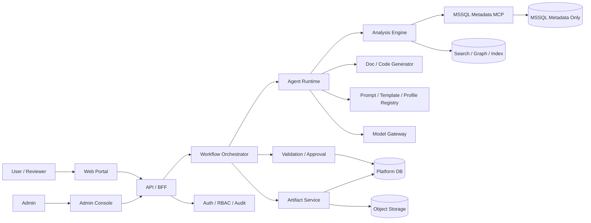

# ARCHITECTURE.md

## 목적

이 문서는 저장소의 구현 기준 아키텍처를 정의한다.  
핵심 목표는 다음 세 가지를 동시에 만족하는 것이다.

- MSSQL Stored Procedure 및 관련 오브젝트의 분석·문서화 자동화
- Java/MyBatis 전환 코드 초안 생성
- 검증·승인·재현 가능성을 가진 중앙 통합형 운영

## 핵심 설계 원칙

1. **Agent보다 Workflow 우선**  
   자유 대화형 자율성보다 상태 기반 실행 흐름을 우선한다.

2. **사실 계층과 생성 계층 분리**  
   메타데이터 수집과 정적 분석은 결정론적 계층에서 수행하고, 생성/요약/추천은 그 위에서 수행한다.

3. **MCP 경계 강제**  
   Agent/runtime/app 계층은 MSSQL 메타데이터에 직접 접근하지 않고 `services/mssql-mcp` 를 통해서만 접근한다.

4. **Canonical 중심 구조**  
   문서, 코드, DDL 초안은 모두 `CanonicalAnalysisModel` 같은 공통 계약을 기준으로 생성한다.

5. **승인 게이트 내장**  
   Draft → Validate → Review → Approve → Publish 를 벗어난 배포형 흐름을 금지한다.

## 시스템 구성



## 컨테이너 책임

### Web Portal / Admin Console
- 사용자 요청 등록
- 결과 미리보기
- 승인/반려
- 관리자 설정

### API / BFF
- 입력 검증
- 인증/인가 연계: production identity 는 verified OIDC/JWT, role source 는 PLF `AUTH_USERS` / `AUTH_ROLES` / `AUTH_USER_ROLES`, validation/approval write action 은 `REVIEWER`/`ADMIN`
- job/artifact 응답 조합

### Workflow Orchestrator
- 작업 상태 전이
- 단계 실행 순서
- 재시도/중단/재개
- registry version binding

### Agent Runtime
- 프롬프트 조합
- tool call orchestration
- evidence binding
- LLM 사용이 필요한 부분의 제한적 생성

### Analysis Engine
- SP parser
- dependency resolver
- result set inference
- transaction/exception/dynamic SQL/temp table detectors
- schema search / metadata enrichment

### Generator
- SP 분석 문서
- 의존성 보고서
- Mapper XML / Interface / Service
- DTO / VO / Model
- DDL 초안

### Validation / Approval
- 규칙 검증
- evidence coverage
- manual review points
- preview
- approval record

### Artifact Service
- 버전 관리
- draft/approved/published 상태 관리
- 파일 보관
- export

### MSSQL Metadata MCP
- 읽기 전용 메타데이터 도구 제공
- 자유 SQL 실행 금지
- snapshot/evidence 반환

## 핵심 데이터 계약

### WorkRequest
- request type
- target objects
- desired outputs
- db profile
- requester / reviewer group

### MetadataSnapshot
- db profile
- captured time
- object scope
- source hash
- evidence refs

### CanonicalAnalysisModel
- procedure signature / parameters
- inferred result sets
- dependencies and call graph
- transaction / exception / dynamic SQL / temp table patterns
- business rules
- modernization points
- evidence refs
- registry version refs
- snapshot id

### DraftArtifact
- artifact type
- content
- template/generator version
- evidence refs

### ValidationReport
- checks
- severity
- pass/fail
- missing evidence
- manual review points

### ApprovalRecord
- reviewer
- decision
- comments
- timestamp
- approved version

## 구현 모듈과 저장소 매핑

```text
apps/web
  - request UI
  - artifact preview
  - approval screens

apps/api
  - request/job APIs
  - workflow orchestration
  - approval endpoints
  - registry/admin endpoints

services/mssql-mcp
  - MSSQL metadata adapters
  - tool schemas
  - read-only enforcement
  - contract tests

packages/domain
  - canonical contracts
  - enums / status models
  - DTO schemas

packages/analysis
  - parsing / dependency / search logic

packages/generation
  - doc/code generators
  - renderers
  - naming rules

packages/validation
  - validators
  - evidence coverage
  - quality gates

packages/templates
  - prompt templates
  - artifact templates
  - reusable rule snippets
```

## 현재 통합 구현 상태

- `apps/api` 는 OpenAPI skeleton 에 맞춘 route surface 와 request/job/artifact/validation/approval decision recording happy path 를 제공한다.
- `apps/web` 는 Next.js shell 이며 기본값은 mock adapter 다. 실제 승인 확정, publish, DDL 실행, row-data 조회 UI 는 제공하지 않는다.
- `services/mssql-mcp` 는 read-only catalog, profile registry, fixture-backed tool execution, optional live readiness boundary 를 제공한다. live metadata query 구현은 아직 완료 기능이 아니다.
- `packages/analysis`, `packages/generation`, `packages/validation` 은 deterministic parser/renderer/validator slice 를 제공하되 full CanonicalAnalysisModel 은 `REVIEW_REQUIRED` candidate 로 남긴다.
- `tests/e2e` 와 `tests/eval` 은 `master` metadata profile 과 fixture snapshot 을 기준으로 최소 happy path 를 검증한다. P08A 이후에는 `fixtures/pilot/ppm_object_selection_v1/selected_objects.yaml` 이 PPM 대표 오브젝트 선정 상태를 나타내며, live metadata 불가 시 `template_only` 상태로 유지한다.
- P19 기준 production auth/RBAC source of truth 는 `docs/admin-guide/auth-rbac-production-source.md` 와 ADR-0006 에 정의한다. Verified OIDC/JWT 가 actor identity source 이고, PLF auth table membership 이 role source 다. Validation/approval route enforcement 와 401/403 negative tests 는 구현되었지만, live IdP/JWKS 와 운영 PLF role membership wiring 은 `AUTH_RBAC_LIVE_IDP_PLF_WIRING_UNVERIFIED` future hardening item 으로 deferred 상태다. 현재 opening posture 는 controlled `CONDITIONAL_GO` 이며 `production_ready: false` 는 유지한다.

## 저장소 경계 규칙

- `apps/api` 는 MSSQL 에 직접 붙지 않는다.
- `services/mssql-mcp` 는 메타데이터 읽기 전용이다.
- 생성기는 raw MSSQL metadata 가 아니라 canonical model 기준으로 동작한다.
- validation 결과 없이 artifact 를 publish 하지 않는다.
- registry version 이 고정되지 않은 생성 결과는 승인 대상이 아니다.
- production auth/RBAC 는 mock header, hardcoded actor, fixture token 으로 대체하지 않는다.

## 현재 기준 파일

- OpenAPI 초안: `spec/openapi/ai_agent_platform_openapi_v1.yaml`
- Platform DB DDL 초안: `db/schema/ai_agent_platform_schema_v2_dbo_prefix.sql`
- Domain enum / mapping 기준: `packages/domain/src/ai_agent_domain/models.py`
- MSSQL Metadata MCP catalog: `spec/mcp/mssql_metadata_tool_catalog.yaml`
- Validation rules: `spec/validation/validation_rules.yaml`
- Policy assets: `spec/policy/`

DDL v2 의 persisted enum 이름을 storage 기준으로 삼고, OpenAPI 의 요청 `outputs` 는 사용자-facing 그룹(`RequestedOutputType`)으로 유지한다. 요청 output 은 domain 의 mapping 을 통해 하나 이상의 persisted `ArtifactType` 으로 연결한다.

기본 MSSQL metadata profile id 는 `master` 이며, platform DB profile `plf` 는 `PLF`, pilot analysis target profile `ppm` 은 `PPM` 을 가리킨다. profile id 와 database 이름은 `config/mssql/local_docker_profiles.yaml` 에서 분리해 관리한다. PPM 이 없거나 접근 불가하면 PLF로 대체하지 않고 blocker 로 보고한다.

## 아키텍처 결정 체크리스트

아래 항목 중 하나라도 바뀌면 `ARCHITECTURE.md`, `POLICY.md`, `EVAL_SPEC.md` 를 함께 점검한다.

- 서비스 경계
- API contract
- CanonicalAnalysisModel 구조
- artifact lifecycle
- approval / validation 흐름
- DB / object storage / index 전략
- MCP tool surface

## 외부 DB 운영 경계

- Platform DB 와 MSSQL metadata source 는 외부 환경에서 관리한다.
- 저장소는 DB container lifecycle 을 소유하지 않는다.
- 스키마 변경은 `db/schema/` 의 versioned SQL 로만 표현하고, 실제 DB 반영은 수동 절차로 분리한다.
- `services/mssql-mcp` 는 외부의 읽기 전용 metadata source 에 연결될 수 있지만, 그 DB 의 기동/중지나 스키마 적용을 수행하지 않는다.

## 테스트 실행 구조

```text
docker/test/
  - Dockerfile.python
  - Dockerfile.web
  - docker-compose.yml
```

- `make test` 는 파이썬 테스트 러너 컨테이너를 기동해 검증한다.
- `make test-web-smoke` 는 web 컨테이너에서 현재 단계의 build smoke 를 수행한다.
- 테스트가 외부 DB 를 필요로 하면 환경변수로 연결만 허용하며, 저장소가 DB 를 생성/파괴하지 않는다.
