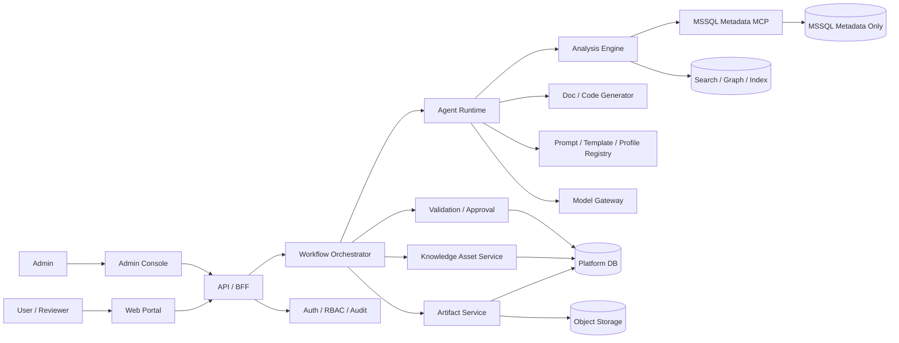

# ARCHITECTURE.md

## 목적

이 문서는 저장소의 구현 기준 아키텍처를 정의한다.  
핵심 목표는 다음 세 가지를 동시에 만족하는 것이다.

- MSSQL Stored Procedure 및 관련 오브젝트의 분석·문서화 자동화
- Java/MyBatis 전환 코드 초안 생성
- 검증·caveat·재현 가능성을 가진 중앙 통합형 운영

## 핵심 설계 원칙

1. **Agent보다 Workflow 우선**  
   자유 대화형 자율성보다 상태 기반 실행 흐름을 우선한다.

2. **사실 계층과 생성 계층 분리**  
   메타데이터 수집과 정적 분석은 결정론적 계층에서 수행하고, 생성/요약/추천은 그 위에서 수행한다.

3. **MCP 경계 강제**  
   Agent/runtime/app 계층은 MSSQL 메타데이터에 직접 접근하지 않고 `services/mssql-mcp` 를 통해서만 접근한다.

4. **Canonical 중심 구조**  
   문서, 코드, DDL 초안은 모두 `CanonicalAnalysisModel` 같은 공통 계약을 기준으로 생성한다.

5. **검증 게이트 내장**
   P25 기본 제품 플로우는 Draft → Validate → `VALIDATION_COMPLETE` 에서 멈추며,
   review/approval 은 deferred capability 로만 남긴다. Publish/deploy/apply 흐름은 여전히 금지한다.

## 시스템 구성



## 컨테이너 책임

### Web Portal / Admin Console
- 사용자 요청 등록
- 결과 미리보기
- validation evidence 확인
- deferred approval compatibility 상태 확인
- 관리자 설정

### API / BFF
- 입력 검증
- 인증/인가 연계: production identity 는 verified OIDC/JWT, role source 는 PLF `AUTH_USERS` / `AUTH_ROLES` / `AUTH_USER_ROLES`, validation/deferred approval write action 은 `REVIEWER`/`ADMIN`
- job/artifact 응답 조합

### Workflow Orchestrator
- 작업 상태 전이
- 단계 실행 순서
- 재시도/중단/재개
- registry version binding
- baseline metadata 수집 후 bounded AI tool planner 를 실행해 active/read-only MCP tool 후보 중
  필요한 추가 metadata evidence 를 내부 registry 로만 수집
- process-local admission control 로 active workflow/MCP metadata calls 를 제한하고 초과 시
  `WORKFLOW_BACKPRESSURE` 또는 `MCP_BACKPRESSURE` 로 응답

### Agent Runtime

- Remote model provider mode defaults to official OpenAI. `LLM_REMOTE_PROVIDER=pgpt` uses the private P-GPT `/v1/responses` contract with a minimal `model`, `instructions`, and message-array `input` request while retaining JSON/SSE response parsing.
- 프롬프트 조합
- bounded metadata tool planning
- evidence binding
- LLM 사용이 필요한 부분의 제한적 생성
- OpenAI Responses API 는 `ModelGateway` adapter 뒤에서만 호출
- SP semantic analysis 는 `SemanticAnalysisTask` 단위로 실행하며 여러 SP task 는 `LLM_SP_CONCURRENCY`
  기본값 2 안에서 fan-out 할 수 있다. 단일 SP API shape 는 유지한다.
- 각 SP task 는 high-quality 기본값에서 deterministic evidence digest, business rule extraction, conversion readiness, migration guide insights, evidence critic, optional repair stage 로 나뉜다.
- structured output schema 는 deterministic fact id 를 `evidenceRefs` enum 으로 제한하고, runtime 은
  prompt/input/output hash 같은 trace ref 를 claim evidence 로 저장하지 않도록 repair 한다.
- raw SP definition 은 명시 옵션이 켜진 실행 중 입력으로만 사용하고 플랫폼 DB,
  artifact, audit log, API 응답에는 저장하지 않음
- metadata tool planning output 은 strict JSON schema 를 사용하며 실제 MCP 실행은 API workflow 의
  deterministic policy gate 가 수행한다.

### Analysis Engine
- SP parser
- dependency resolver
- result set inference
- transaction/exception/dynamic SQL/temp table detectors
- schema search / metadata enrichment

### Generator
- SP 분석 문서
- 의존성 보고서
- Mapper XML / Interface / Service
- DTO / VO / Model
- DDL 초안

### Validation / Approval
- 규칙 검증
- evidence coverage
- manual review points
- preview
- approval record

### Artifact Service
- 버전 관리
- draft/approved/published 상태 관리
- 파일 보관
- export

### Knowledge Asset Service
- SP analysis, dependency evidence, metadata profile, DTO readiness, canonical analysis 를 sanitized versioned knowledge asset 으로 저장
- 동일 logical asset key 에서 `contentHash` 가 같으면 current version 을 재사용하고, 바뀔 때만 새 version 생성
- `mcp.*`, `metadata.profile.*`, `canonical.*` fact id 와 제한된 edge type 으로 fact graph 구성
- JSONL / GRAPH_JSON export 제공
- raw SP definition, SQL text, row data, secret, raw prompt/provider trace 는 저장/응답/export 에 포함하지 않음

### MSSQL Metadata MCP
- 읽기 전용 메타데이터 도구 제공
- 자유 SQL 실행 금지
- snapshot/evidence 반환
- P27 기준 dependency closure/reference resolver 는 active read-only MCP tool 로
  fixture-first hardening 상태이며, `P27_HARD_LIVE_GATE=1` 에서만 PPM hard-live evidence gate 를 실행한다.
  P28 기준 전용 API invocation route 는 두 P27 dependency evidence tool 만 안전하게 호출하도록
  열고, P29 기준 Web diagnostic UI 와 workflow dependency evidence wiring 이 이 route 를 사용한다.

## 핵심 데이터 계약

### WorkRequest
- request type
- target objects
- desired outputs
- db profile
- requester / reviewer group

### MetadataSnapshot
- db profile
- captured time
- object scope
- source hash
- evidence refs

### CanonicalAnalysisModel
- schema version: `CanonicalAnalysisModel.v2`
- procedure signature / parameters
- inferred result sets
- dependencies and call graph
- transaction / exception / dynamic SQL / temp table patterns
- business rules
- modernization points
- evidence refs
- registry version refs
- snapshot id
- analysis subject
- metadata profiles
- dependency evidence
- DTO readiness
- fact graph
- knowledge asset refs

### DraftArtifact
- artifact type
- content
- template/generator version
- evidence refs

### ValidationReport
- checks
- severity
- pass/fail
- missing evidence
- manual review points

### ApprovalRecord
- reviewer
- decision
- comments
- timestamp
- approved version

## 구현 모듈과 저장소 매핑

```text
apps/web
  - request UI
  - artifact preview
  - approval screens

apps/api
  - request/job APIs
  - workflow orchestration
  - approval endpoints
  - registry/admin endpoints
  - knowledge asset persistence / fact graph / export endpoints

services/mssql-mcp
  - MSSQL metadata adapters
  - tool schemas
  - read-only enforcement
  - contract tests

packages/domain
  - canonical contracts
  - enums / status models
  - DTO schemas
  - CanonicalAnalysisModel.v2 knowledge/fact graph extension

packages/analysis
  - parsing / dependency / search logic

packages/agent-runtime
  - OpenAI / fake model gateway
  - prompt renderer
  - strict structured output parser
  - per-SP staged semantic analysis runner
  - deterministic evidence-ref repair and review marker injection
  - model invocation hash / token / latency summary

packages/generation
  - doc/code generators
  - renderers
  - naming rules

packages/validation
  - validators
  - evidence coverage
  - quality gates

packages/templates
  - prompt templates
  - artifact templates
  - reusable rule snippets
```

## 현재 통합 구현 상태

- `apps/api` 는 OpenAPI skeleton 에 맞춘 route surface 와 request/job/artifact/latest-validation/validation happy path 를 제공한다. P25 기본 workflow 는 validation 이후 `VALIDATION_COMPLETE` 에서 종료하며, approval decision API 는 추후 재활성화 가능한 deferred capability 로 유지한다.
- `apps/web` 는 P21 기준 runtime/default path 에서 HTTP API client 만 사용한다. `PORTAL_API_MODE=http` 와 `PORTAL_API_BASE_URL` 이 없으면 dependency blocker 를 렌더링하며, mock adapter 를 production 또는 default runtime 으로 사용하지 않는다. P25 기준 review decision 화면과 CTA 는 기본 UI 에서 제거되었다.
- `services/mssql-mcp` 는 read-only catalog, profile registry, fixture-backed tests, optional live readiness boundary 를 제공한다. `P21_LIVE_PORTAL_GATE=1` 에서는 live PPM metadata access 가 필수이고 fixture fallback 또는 PLF fallback 은 blocker 다. P27 기준 `get_procedure_dependencies` 계약은 resolution confidence/evidence kind/unresolved reason/chain 을 optional evidence 로 확장하고, `get_dependency_closure` 와 `resolve_dependency_reference` 는 active read-only fixture-first hardened MCP tool 로 구현된다. `P27_HARD_LIVE_GATE=1` 은 PPM selected objects 대상으로 closure/resolver evidence 를 검증하며, 활성화 후 missing PPM prerequisite, inaccessible PPM, template-only selection, PLF fallback 은 blocker failure 다. P28 기준 전용 API invocation endpoint 는 두 P27 dependency evidence tool 만 public allowlist 로 호출한다. P29 기준 `/metadata/dependencies` Web diagnostic UI 는 이 route 를 수동 진단용으로 사용하고, workflow orchestration 은 PROCEDURE target 에 대해 `get_dependency_closure` evidence digest 와 evidence refs 만 병합한다. P29B 기준 DB migration, persisted artifact type, workflow state transition 은 새로 만들지 않고 deferred 로 확정했으며, 기존 metadata collection payload 의 sanitized `dependencyEvidence` 와 기존 draft artifact evidence refs 만 사용한다. P33 기준 active/read-only successful MCP tool result 는 process-local TTL/LRU cache 로 재사용할 수 있고, cache trace 는 `cacheStatus`, `cacheKeyHash`, `cacheAgeMs` 만 남긴다.
- `packages/analysis`, `packages/generation`, `packages/validation` 은 deterministic parser/renderer/validator slice 를 제공하되 full CanonicalAnalysisModel 은 `REVIEW_REQUIRED` candidate 로 남긴다.
- `packages/agent-runtime` 은 P22 기준 OpenAI Responses API adapter 와 fake adapter 를 제공한다. P26 기준 API/Web 기본값은 high-quality hybrid 분석이며 semantic analysis profile `gpt-5.5`, transient SP definition input, guide/conversion insight schema 를 사용한다. fast/test profile 기본 모델은 `gpt-5-nano` 이며 `OPENAI_MODEL_FAST_TEST` 로 optional live confidence 모델을 바꿀 수 있다. 기본 테스트는 remote API 를 호출하지 않는다.
- P23/P26 LLM-assisted SP analysis quality eval 은 simple/medium/complex synthetic fixtures 를 `FakeModelGateway` 로 fixture-first scoring 한다. API/Web live 기본 profile 은 `openai_sp_semantic_analysis` / `gpt-5.5` 이고, `openai_fast_test` 는 기본 `gpt-5-nano` 에서 `OPENAI_MODEL_FAST_TEST` 로 optional live confidence 모델을 바꿀 수 있다. Optional live OpenAI quality gate 는 confidence signal 이며 production readiness 기준이 아니다. Live 품질 gate 실패는 P24 guide generation failure 가 아니라 P23/P26 semantic-analysis confidence failure 로 해석한다.
- P24 SP migration guide quality eval 은 sanitized simple/medium/complex fixtures 를 기존 `SP_ANALYSIS_DOC` 와 `DEPENDENCY_REPORT` draft artifact type 으로 렌더링하고 `evaluate_p24_migration_guide_quality` 로 점수화한다. 새 persisted artifact type, API/Web/DB schema 변경, live DB access 는 없으며 Java/MyBatis 는 `draft_only_readiness_notes` 경계에 남긴다.
- Workflow orchestrator 는 metadata 수집과 deterministic analysis 이후 bounded AI tool orchestration 과 LLM semantic analysis 를 기본 실행한다. `useAiToolOrchestration=true` 이 기본값이며 `useLlmAnalysis=false` 이면 자동 비활성화된다. AI planner 는 active/read-only MCP catalog 전체를 후보로 보지만, 실행은 내부 registry 와 deterministic policy gate 로만 수행하고 public invoke API allowlist 는 확장하지 않는다. 수집 결과는 sanitized `aiToolEvidence` 와 `mcp.<toolName>.<hash>` deterministic fact id 로 semantic prompt 에 전달된다. P33 이후 fact id 는 volatile `snapshotId`/`collectedAt` 이 아니라 sanitized content 와 argument hash 기반 `contentHash` 로 안정화하며, planner metrics 는 cache hit/miss count 를 포함한다. LLM output 은 `business_rules`, `modernization_points`, `risk_flags`, `review_markers`, `conversion_guidance`, `migration_guide_insights`, `assumptions` 보강으로 제한하고, LLM inference evidence 는 validation 에서 `REVIEW_REQUIRED` 로 유지한다.
- Metadata analysis 는 `POST /api/v1/metadata/analyze` 별도 API 로 제공한다. 기존
  `GET /api/v1/metadata/search` 는 deterministic identity/evidence search 로 유지하고,
  analyze API 안에서만 bounded AI tool planner 를 기본 실행한다. 이 경로도 active/read-only MCP
  catalog 전체를 후보로 보되 내부 registry 로만 실행하며, public invoke API allowlist 는 계속
  `get_dependency_closure`, `resolve_dependency_reference` 두 개로 제한한다. 결과는 sanitized
  `aiToolEvidence`, `deterministicFacts`, `mcp.<toolName>.<hash>` fact id, metadata insights,
  object profiles, category insight groups, dependency graph, DTO readiness, review markers,
  knowledge asset summaries 를 반환한다. P34 기준 기본 `persistKnowledge=true` 로 sanitized
  metadata profile/dependency/dto readiness knowledge asset 도 축적하지만, persisted artifact 또는
  workflow state transition 은 추가하지 않는다.
- `tests/e2e` 와 `tests/eval` 은 `master` metadata profile 과 fixture snapshot 을 기준으로 최소 happy path 를 검증한다. P08A 이후에는 `fixtures/pilot/ppm_object_selection_v1/selected_objects.yaml` 이 PPM 대표 오브젝트 선정 상태를 나타내며, live metadata 불가 시 `template_only` 상태로 유지한다.
- P19 기준 production auth/RBAC source of truth 는 `docs/admin-guide/auth-rbac-production-source.md` 와 ADR-0006 에 정의한다. Verified OIDC/JWT 가 actor identity source 이고, PLF auth table membership 이 role source 다. Validation/approval route enforcement 와 401/403 negative tests 는 구현되어 있으나 P25 기본 product path 는 approval UI 를 노출하지 않는다. Live IdP/JWKS 와 운영 PLF role membership wiring 은 `AUTH_RBAC_LIVE_IDP_PLF_WIRING_UNVERIFIED` future hardening item 으로 deferred 상태다. 현재 opening posture 는 controlled `CONDITIONAL_GO` 이며 `production_ready: false` 는 유지한다.
- P21 은 Python 3.14 host+Docker baseline 과 no-mock functional portal contract 를 추가한다. Controlled open 은 PLF platform DB 와 PPM read-only metadata prerequisites 가 충족될 때만 유효하며, full production-ready 선언은 여전히 금지한다.

## 저장소 경계 규칙

- `apps/api` 는 MSSQL 에 직접 붙지 않는다.
- `services/mssql-mcp` 는 메타데이터 읽기 전용이다.
- 생성기는 raw MSSQL metadata 가 아니라 canonical model 기준으로 동작한다.
- LLM provider 에 전달된 prompt, raw SP definition, raw provider response text 는 저장하지 않는다.
- agent run trace 는 model/profile/prompt/schema version, input/prompt/output hash,
  token usage, latency, status, schema-valid structured output 만 노출한다.
- validation 결과 없이 artifact 를 publish 하지 않는다.
- registry version 이 고정되지 않은 생성 결과는 승인 대상이 아니다.
- production auth/RBAC 는 mock header, hardcoded actor, fixture token 으로 대체하지 않는다.

## 현재 기준 파일

- OpenAPI 초안: `spec/openapi/ai_agent_platform_openapi_v1.yaml`
- Platform DB DDL 초안: `db/schema/ai_agent_platform_schema_v2_dbo_prefix.sql`
- Agent runtime DDL 초안: `db/schema/ai_agent_platform_schema_v3_agent_runtime.sql`
- Knowledge asset DDL 초안: `db/schema/ai_agent_platform_schema_v5_knowledge_assets.sql`
- Domain enum / mapping 기준: `packages/domain/src/ai_agent_domain/models.py`
- MSSQL Metadata MCP catalog: `spec/mcp/mssql_metadata_tool_catalog.yaml`
- P27 dependency evidence tooling contract: `spec/eval/p27_dependency_evidence_tooling_contract.yaml`
- Validation rules: `spec/validation/validation_rules.yaml`
- Policy assets: `spec/policy/`

DDL v2 의 persisted enum 이름을 storage 기준으로 삼고, OpenAPI 의 요청 `outputs` 는 사용자-facing 그룹(`RequestedOutputType`)으로 유지한다. 요청 output 은 domain 의 mapping 을 통해 하나 이상의 persisted `ArtifactType` 으로 연결한다.

기본 MSSQL metadata profile id 는 `master` 이며, platform DB profile `plf` 는 `PLF`, pilot analysis target profile `ppm` 은 `PPM` 을 가리킨다. profile id 와 database 이름은 `config/mssql/local_docker_profiles.yaml` 에서 분리해 관리한다. PPM 이 없거나 접근 불가하면 PLF로 대체하지 않고 blocker 로 보고한다.

## 아키텍처 결정 체크리스트

아래 항목 중 하나라도 바뀌면 `ARCHITECTURE.md`, `POLICY.md`, `EVAL_SPEC.md` 를 함께 점검한다.

- 서비스 경계
- API contract
- CanonicalAnalysisModel 구조
- artifact lifecycle
- approval / validation 흐름
- DB / object storage / index 전략
- MCP tool surface

## 외부 DB 운영 경계

- Platform DB 와 MSSQL metadata source 는 외부 환경에서 관리한다.
- 저장소는 DB container lifecycle 을 소유하지 않는다.
- 스키마 변경은 `db/schema/` 의 versioned SQL 로만 표현하고, 실제 DB 반영은 수동 절차로 분리한다.
- `services/mssql-mcp` 는 외부의 읽기 전용 metadata source 에 연결될 수 있지만, 그 DB 의 기동/중지나 스키마 적용을 수행하지 않는다.

## 테스트 실행 구조

```text
docker/test/
  - Dockerfile.python
  - Dockerfile.web
  - docker-compose.yml
```

- `make test` 는 파이썬 테스트 러너 컨테이너를 기동해 검증한다.
- `make test-web-smoke` 는 web 컨테이너에서 현재 단계의 build smoke 를 수행한다.
- 테스트가 외부 DB 를 필요로 하면 환경변수로 연결만 허용하며, 저장소가 DB 를 생성/파괴하지 않는다.
