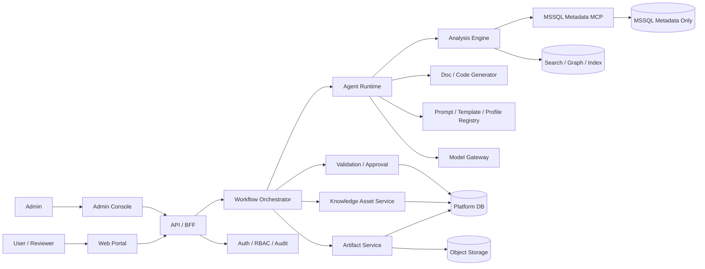

# ARCHITECTURE.md

## P36 Output Contract Architecture

The public generation contract now exposes six final artifact types only:
`SP_ANALYSIS_DOC`, `DEPENDENCY_REPORT`, `DTO_DRAFT`, `SERVICE_DRAFT`,
`MAPPER_INTERFACE`, and `MAPPER_XML`. `JAVA_MYBATIS_DRAFT` remains a request group,
but it expands only to the four Java/MyBatis file artifacts.

`SP_ANALYSIS_DOC` renders the same six-step flow as `MIGRATION_GUIDE.md`.
`DEPENDENCY_REPORT` is an evidence dossier rather than a dependency-only inventory.
Java/MyBatis generation uses `spRebuild`/`evidenceReconstructed` semantics for
evidence-backed business logic drafts while keeping uncertainty as `REVIEW_REQUIRED`.

`DTO_MODEL_DRAFT`, `VO_DRAFT`, `MODEL_DRAFT`, and `DDL_DRAFT` are retired from new
public request/API/UI/validation/generation contracts. Historical `VO_DRAFT`,
`MODEL_DRAFT`, and `DDL_DRAFT` storage rows are preserved because they can be
referenced by versions, validation reports, approval records, exports, and audit/history
surfaces. The manual v9 SQL keeps those type codes as historical-only storage values and
adds a trigger to block new retired artifact inserts/type changes.

## P37 Metadata DTO Draft Preview Architecture

Metadata analysis can optionally emit non-persisted `DTO_DRAFT` previews from sanitized
TABLE/VIEW column metadata. `MetadataAnalysisOptions.generateDtoDrafts` defaults to false;
when enabled, `MetadataAnalysisResponse.generatedDrafts` returns Java DTO preview content,
file name, object ref, target key, evidence refs, and `REVIEW_REQUIRED` reasons. These previews
are not workflow artifact records, do not create or apply source files, and do not authorize
row data access, SQL/SP definition storage, procedure execution, DDL/DML, deploy, publish, or
automatic conversion.

## P38 Metadata Design Chat Architecture

Metadata design chat is a durable run surface separate from workflow artifacts. `POST
/api/v1/metadata/design-runs` stores sanitized request JSON in manual-apply v10
`METADATA_DESIGN_RUNS`, runs read-only MCP metadata searches, and stores sanitized result/error
JSON for polling and conversation replay. `GET /api/v1/metadata/design-runs/{runId}` returns one
run; `GET /api/v1/metadata/design-conversations/{conversationId}` returns recent runs in the
conversation.

The generation service normalizes field names, descriptions, and table hints, optionally invokes
the bounded LLM metadata planner for intent planning, then deterministically calls only read-only
metadata tools such as `search_columns`, `search_tables`, `find_similar_tables`, and
`get_table_schema`. It uses `platform_db_standardization_rules_for_ai.json` for standard names and
types. Unconfirmed metadata, inferred names/types, and PK/FK/index gaps remain `REVIEW_REQUIRED`.

The result contains `createTableScriptPreview` and an optional `DTO_DRAFT` preview. The script is a
manual-review preview only: it is not persisted as an artifact, does not revive a retired DDL output
contract, and is never applied by the platform.

## P40 Metadata Design Natural-Language Chat Architecture

P40 keeps the P38 endpoints and v10 `METADATA_DESIGN_RUNS` JSON storage, and adds
chat-oriented intent structure to the result. `MetadataDesignOptions.conversationMode`
selects `NEW_DESIGN` or `REFINE_CURRENT`; `MetadataDesignResult.interpretedIntent`
contains sanitized intent, table/field candidates, modifications, confidence, and
`REVIEW_REQUIRED` reasons, while `appliedChanges` records deterministic add/remove/type-change
effects.

The service first extracts a bounded natural-language intent. When LLM planning is unavailable
or disabled, deterministic Korean/English fallback supports examples such as
`고객명, 주소, 주문일이 있는 주문 요청 테이블`, `배송메모 추가`, and
`주문일은 날짜 타입으로 바꿔`. Extracted field candidates then flow through the same read-only
MCP evidence path (`search_columns`, `search_tables`, `find_similar_tables`,
`get_table_schema`) and standardization policy as P38.

For `REFINE_CURRENT`, the API reads the latest `SUCCEEDED` run in the conversation and uses its
`tableProposal` as the baseline. If no baseline exists or the natural-language instruction is
ambiguous, the service does not silently start over; it returns caveats and review markers. The Web
surface removes field-row input controls, leaving message, metadata profile, conversation mode, and
optional table name hint. No apply/execute/deploy/publish control is introduced.

## P41 SP Operation Model Architecture Groundwork

P41 introduces `SpOperationModel.v0.1` as an internal planning contract between SP
analysis and Java/MyBatis generation. It does not replace `CanonicalAnalysisModel.v2`;
it narrows code-generation planning around operation branches, sanitized statement
evidence, and DTO blueprints.

For `PCO_GU_ManageBond_PRC`, P41 models the `CRUDFlag` branches
`R/A/C/U/D/VENDOR_U/ONLINE_U`, plus branch variables such as `@BondKindCode`,
`@GUBUNFlag`, and `@SValue`. The contract records statement ids, operation type,
target ref, input/output/write field candidates, cross-database flags, evidence refs,
and `REVIEW_REQUIRED` markers. It also records DTO blueprints by role such as
`QUERY`, `RESULT`, `COMMAND`, `BATCH_ITEM`, and `CALL_REQUEST`.

The implementation path is split deliberately:
deterministic analysis creates sanitized `statementEvidence`, the structured planner
uses the existing Responses/httpx gateway and strict JSON schema to produce
`SpOperationModel.v0.1`, and the Java/MyBatis renderer consumes that model
deterministically. `OperationModel` inference is not promoted to metadata fact; weak
branch/DTO naming and uncertain dependencies stay `REVIEW_REQUIRED`.

In the workflow orchestrator, `JAVA_MYBATIS_DRAFT` now has an operation-model
planning stage between semantic analysis and artifact generation. The stage calls the
deterministic extractor with transient procedure definition text, stores only
sanitized statement evidence summaries and validated operation-model payloads, and
injects the resulting `operationModel` into `GenerationContext.request`. Recovery
reuses an existing successful `LLM_SP_OPERATION_PLANNER` AgentRun when present. If
the definition is unavailable, LLM planning is disabled, or the planner fails, the
workflow stores a review-required fallback operation model with
`P41_OPERATION_MODEL_REVIEW_REQUIRED` so generated Java/MyBatis output does not
collapse back to the legacy single DTO silently.

The generation boundary remains draft-only. Public artifact types are not expanded:
`DTO_DRAFT` can contain a multi-file DTO bundle when `operationModel.dtoBlueprints`
is supplied, while `SERVICE_DRAFT`, `MAPPER_INTERFACE`, and `MAPPER_XML` remain
single files. Workflow persistence stores each DTO bundle file as a separate
`DTO_DRAFT` artifact keyed by `bundleFilePath`; service, mapper interface, and mapper
XML remain one artifact each. DTO artifact `extra` records `bundleFilePath`,
`bundleRole`, `operationModelSchema`, `operationIds`, and `dtoRole` when available.
Without `operationModel`, the legacy single DTO path remains for direct renderer
backward compatibility and is still considered insufficient for complex SPs. P41 adds
no UI, OpenAPI, DB schema, live MCP public tool, procedure execution, row-data query,
automatic DDL/DML apply, or generated-source deployment.

## P42 AI Draft Pack Architecture Groundwork

P42 defines a second Java/MyBatis draft-generation path for complex SPs when the
operation-model-first path fails before useful code is produced. The internal
contract is `AiJavaMyBatisDraftPack.v0.1`: a sanitized file bundle containing
`files[]` with artifact type, path, role, class name, content, operation ids,
evidence refs, and review markers. It is a draft-generation contract only and
does not replace `CanonicalAnalysisModel.v2` or public artifact types.

P42 derives the draft file inventory from sanitized `SpOperationModel.v0.1`
contracts rather than target-specific runtime constants. DTO blueprints,
statement evidence, branch conditions, and operation responsibilities define the
expected DTO files and method ids. `PCO_GU_ManageBond_PRC` remains the benchmark
fixture: its operation model should naturally produce separate DTO files such as
`ManageBondSearchCriteria`, `ManageBondSearchRow`,
`ApproveAdvanceBondCommand`, `ApproveDefectBondCommand`, `FinanceTransferCommand`,
`CreateBondCommand`, `CreateRetentionBondBatchItem`, `UpdateBondCommand`,
`DeleteBondCommand`, `VendorBondUpdateCommand`, and `OnlineBondUpdateCommand`.
Service, Mapper interface, and Mapper XML remain single draft files but must
expose the derived branch/use-case methods and reference the branch-specific DTOs.

The implementation path is AI-heavy but validation-gated: the model produces
file inventory, then file content, then deterministic validation/repair handles
schema conformance, fallback blockers, evidence refs, and policy markers. P42B
implements the strict `AiJavaMyBatisDraftPack.v0.1` runtime schema and prompt
path, P42C validates Java/XML content statically, and P42D wires
`JAVA_MYBATIS_DRAFT` to prefer validated AI Draft Pack files for workflow
persistence instead of the P41 fallback Java renderer.

If the deterministic inventory contract is incomplete for a complex SP, the
workflow records `P42_INVENTORY_CONTRACT_INCOMPLETE` and persists no Java/MyBatis
draft artifacts. This covers collapsed two-DTO outputs, uncovered statement
evidence, missing DTO blueprint coverage, and write/call responsibilities without
command, batch item, or call request DTOs.

Workflow persistence stores each DTO pack file as its own `DTO_DRAFT` row keyed
by `bundleFilePath`; Service, Mapper interface, and Mapper XML remain single
rows. Artifact `extra` carries AI Draft Pack schema, target ref, agent run id,
file role, DTO role where present, operation ids, quality score, source evidence
refs in `aiEvidenceRefs`, and review markers. Public artifact `evidenceRefs`
stay within the existing API evidence enum, while AI draft evidence ids remain
internal artifact metadata. Gateway/schema/quality failures record
`P42_AI_DRAFT_PACK_FAILED`; disabled or unavailable safe context records
`P42_AI_DRAFT_PACK_REVIEW_REQUIRED`. Neither path persists
`OperationModelReviewRequired*` Java/MyBatis fallback skeletons.

P42E adds a route-level replay gate for `PCO_GU_ManageBond_PRC`: a fake
metadata gateway and fake model gateway submit a new `JAVA_MYBATIS_DRAFT`
workflow job, fetch persisted artifacts through the API, reconstruct an
`AiJavaMyBatisDraftPack.v0.1` payload from stored artifacts, and rerun the P42C
validator. The historical `job_6864d2734e` remains audit context only, not an
acceptance result.

P42G adds an opt-in live confidence gate on the same architecture without
changing public APIs or persistence contracts. `apps/api/scripts/p42_live_ai_draft_pack_probe.py`
uses an in-memory workflow repository. In `P42_LIVE_REPLAY_MODE=sanitized_fixture`
it uses sanitized fixture facts and the existing Responses/httpx model gateway
without live PPM metadata or raw SP external export. In `live_ppm` mode it uses
the existing `McpMetadataGateway` and requires explicit live OpenAI/PPM metadata
gates. It stores no platform DB rows, writes no source files, and returns only
counts, DTO class names, sanitized agent-run summaries, and redaction status.
Persisted in-memory artifacts are reconstructed into
`AiJavaMyBatisDraftPack.v0.1` and checked with the same P42C validator.

P42 blocks `OperationModelReviewRequired*`, single-DTO collapse for complex SPs,
empty content, raw SP or raw guide storage, row-data wording, and source
apply/deploy claims. `ManageBondDTO` remains a fixture-specific blocker for the
ManageBond benchmark, not a production-runtime special case. P42 adds no UI,
OpenAPI, DB schema, public MCP route, procedure execution, row-data query,
automatic DDL/DML apply, or generated-source deployment.

## P43 Framework Adoption Readiness Architecture

P43 introduces no runtime framework switch. It defines an adapter-first
evaluation track for deciding whether a framework should replace or augment the
current Responses/httpx model gateway for complex SP analysis and AI Draft Pack
generation. The internal adapter contract is
`AiGenerationFrameworkAdapter.v0.1`, with stages for inventory planning, file
content drafting, repair, and sanitized trace summaries.

The current gateway remains the baseline adapter. OpenAI Agents SDK is the first
candidate because it is close to the existing Responses-oriented model path and
can express agent loops, tool use, handoff-like composition, and traces. LangGraph
is the second candidate when explicit graph state and durable orchestration have
measurable value. Both candidates must run behind the same P42 deterministic
inventory, schema, validation, repair, and no-fallback gates.

Framework traces are treated as high-risk evidence surfaces. Storage-ready
summaries may include stage names, component ids, counts, content hashes, failure
codes, and policy-safe metrics only. Raw prompts, raw provider responses, raw SP
definitions, raw guide body, row data, secrets, and failed generated Java/XML
payloads remain forbidden in repo assets, platform storage, trace payloads, and
docs. P43 adds no public API, DB schema, UI, public MCP route, public artifact
type, procedure execution, row-data query, business DB DDL/DML apply, generated
source apply, or deploy behavior.

P43D adds internal policy gates before candidate framework execution. The
adapter builds a sanitized tool context with target hashes, operation and
inventory ids/counts, allowed evidence refs, quality gates, and
`REVIEW_REQUIRED` markers only. `P43_FRAMEWORK_TOOL_CONTEXT_BLOCKED` stops any
raw prompt/provider/SP/guide/row-data/secret material or source-apply/deploy
claim before a framework stage runs. `P43_FRAMEWORK_RAW_TRACE_BLOCKED` stops
unsafe framework events or storage summaries unless the stored component matches
the hash/count/code allowlist. OpenAI Agents SDK adoption is blocked until
default tracing is disabled or sensitive data capture is excluded; LangGraph
adoption is blocked until graph persistence/checkpointers use a proven redacted
state boundary.

P43E-F close the readiness track with a replay comparison and a reversible
decision gate. The final decision is `pilot`, based on fake-adapter evidence that
candidate output preserves the baseline P42 quality gate, reconstructs persisted
draft artifacts into `AiJavaMyBatisDraftPack.v0.1`, rejects synthetic two-DTO
collapse, and does not depend on ManageBond-specific runtime hardcoding. This
does not switch the production workflow to a framework. P49 supersedes the
production-exported baseline adapter scaffold; the existing Responses/httpx
gateway remains retained only for P-GPT compatibility and emergency rollback.

## P44 Real Framework Runtime Adoption Architecture

P44 supersedes P43 as the active framework direction. The internal
`FrameworkRuntimeConfig.v0.1` factory selects OpenAI Agents SDK for OpenAI remote
AI Draft Pack generation. P-GPT defaults to `responses_httpx` for compatibility,
but an explicit internal `AI_GENERATION_RUNTIME=openai_agents` selection may use
the OpenAI Agents SDK with an approved P-GPT-compatible endpoint. This is an
internal dependency construction decision, not a public request flag.

`OpenAIAgentsFrameworkAdapter` implements the existing
`AiGenerationFrameworkAdapter.v0.1` stage methods with real OpenAI Agents SDK
calls. It validates every output against `AiJavaMyBatisDraftPack.v0.1` and stores
only hashes, counts, stage names, model/profile ids, token counts when available,
and sanitized failure codes. Tracing is disabled with `set_tracing_disabled(True)`
and run config sensitive-data capture disabled before any stage execution.

`LangGraphAiDraftPackOrchestrator` owns the AI Draft Pack stage graph:
`file_inventory -> file_content -> quality_gate -> repair -> final`. It compiles
without a persistent checkpointer, so LangGraph state is transient in-process
state only. The platform workflow repository remains the single persistence
boundary for sanitized AgentRun summaries and draft artifacts.

P44 does not add a public API, DB schema, UI surface, public MCP route, or public
artifact type. Generated artifacts remain draft-only with `productionReady=false`
and `generated_artifacts_production_ready: false`. Procedure execution, row-data
access, business DB DDL/DML, source apply, deploy, raw prompt/provider response
storage, raw SP definition storage, raw guide body storage, and automatic
conversion approval remain forbidden.

P45 is an explicit optional live gate around the same internal architecture. It
runs only with `P44_OPENAI_AGENTS_LIVE_GATE=1`, OpenAI remote env, and trace
redaction locks, and it uses sanitized fixture context rather than live PPM row
data or procedure execution. It accepts official OpenAI evidence and approved
P-GPT-compatible SDK evidence when the runtime is explicit, the endpoint is
configured, native SDK structured output is disabled, and P42/P44 post-validation
passes.
P46 keeps the architecture default on OpenAI Agents SDK plus LangGraph for
OpenAI while retaining `responses_httpx` for P-GPT default compatibility and
emergency rollback until a separate cleanup gate approves deletion.

## P47 Generic AI Draft Quality Uplift Architecture

P47 improves AI Draft Pack quality through a generic evidence bundle before the
OpenAI Agents/LangGraph runtime stages. The prompt renderer builds
`DraftPackEvidenceBundle.v0.1` from sanitized operation summaries, statement
evidence, expected inventory, platform knowledge summaries, and review markers.
It exposes operation coverage, DTO responsibility, review marker, and mapper
coverage matrices to the model without storing raw prompts, raw provider
responses, raw SP definitions, raw guide bodies, row data, secrets, or failed
Java/XML payloads.

The bundle is internal-only and transient. It does not create a new public API,
artifact type, DB table, UI surface, MCP route, or source-apply path. The same
P42 schema, inventory contract, static Java/MyBatis validator, P44 adapter
policy, and LangGraph quality/repair stages remain authoritative. ManageBond
DTO and method names are benchmark comparison metrics only; generic pass/fail is
based on discovered operation ids, DTO responsibilities, mapper statement wiring,
and required `REVIEW_REQUIRED` markers.

P47 also applies a generic reference guard after successful structured draft
generation. It preserves deterministic expected DTO references in draft metadata
and review comments before the P42 static validator runs, records a sanitized
component summary, and does not use target-specific DTO answer keys.

The runtime profile `openai_ai_draft_pack` selects high-quality OpenAI model
settings for live draft-pack generation through `OPENAI_MODEL_AI_DRAFT_PACK` and
`OPENAI_REASONING_EFFORT_AI_DRAFT_PACK`. The profile falls back to the analysis
model family rather than `openai_fast_test`; P-GPT remains on `responses_httpx`
by default, with compatible SDK evidence allowed only through explicit internal
runtime selection.

## P48 Unified Structured Framework Runtime Architecture

P48 adds `AiStructuredFrameworkAdapter.v0.1` for non-draft-pack structured LLM
tasks. `FrameworkModelGateway` still implements the existing `ModelGateway`
methods, but for OpenAI remote structured calls it delegates SP semantic
analysis, metadata tool planning, metadata analysis, platform tool planning, and
SP operation-model planning to `OpenAIAgentsStructuredAdapter`. The adapter
reuses the existing prompt renderers, strict schema parsers, P-GPT normalizers,
and post-validation logic instead of creating a parallel schema stack.

`FrameworkRuntimeConfig.v0.1` now records both `ai_generation_runtime` and
`structured_llm_runtime`. OpenAI remote defaults to `openai_agents` for
structured LLM paths; P-GPT defaults to `responses_httpx` unless
`AI_GENERATION_RUNTIME=openai_agents` or `AI_STRUCTURED_LLM_RUNTIME=openai_agents`
is explicitly set. Setting the structured runtime to `responses_httpx` keeps the
existing `OpenAIModelGateway` rollback path. AI Draft Pack remains routed by
`WorkflowService` through the P44 `OpenAIAgentsFrameworkAdapter` and
`LangGraphAiDraftPackOrchestrator`.

Trace summaries for P48 use the same sanitized framework summary shape with the
`AiStructuredFrameworkAdapter.v0.1` adapter contract. Stored summaries may carry
only stage, adapter id, framework id, counts, hashes, token metrics, component
ids, and sanitized failure codes. Raw prompts, raw provider responses, raw SP
definitions, raw guide bodies, row data, secrets, failed Java/XML payloads,
source apply, deploy, and procedure execution remain forbidden.

No public surface changes are introduced: no public API, DB schema, UI, public
MCP route, public artifact type, request flag, row-data query, procedure
execution, source apply, deploy, or production readiness change.

## P49 Framework Runtime Cleanup Architecture

P49 makes `p49_framework_runtime_consolidation_cleanup@0.1.0` the cleanup index
for framework-runtime evidence. P48 remains the active structured LLM runtime
through `FrameworkModelGateway` and `OpenAIAgentsStructuredAdapter`; P44 remains
the active AI Draft Pack runtime through `OpenAIAgentsFrameworkAdapter` and
`LangGraphAiDraftPackOrchestrator`; P43 is retained only as historical adoption
evidence.

The production runtime no longer exports P43 baseline/fake framework adapter
scaffolding. Equivalent fake adapters live under test helpers for historical
fixtures and orchestrator unit coverage. `OpenAIModelGateway` and
`responses_httpx` remain in the architecture for P-GPT default compatibility and
explicit emergency rollback only.

P49 does not introduce a public API, DB schema, UI surface, public MCP route,
public artifact type, row-data query, procedure execution, source apply, deploy,
or production readiness change.

## P35 Source Context Architecture

Semantic SP analysis now uses a Copilot-style context assembly path: metadata collection creates
deterministic evidence, local static analysis creates a sanitized `ProcedureSourceMap`, and the
runtime builds stage-specific `ContextPack` payloads from bounded retrieved spans. Raw selected
span text is transient model input only; persisted metadata, artifacts, knowledge assets, exports,
and agent traces keep only source map coverage, span ids, line ranges, risk tags, object refs,
evidence refs, and budget/review summaries.

The default request behavior is `sourceContextMode=RETRIEVED_SPANS`. Setting
`sourceContextMode=NONE` leaves semantic analysis with metadata/static evidence digest only.
Provider context-length failures retry with reduced spans, then fall back to evidence digest only
with `LLM_CONTEXT_BUDGET_REVIEW_REQUIRED`.

Confirmed same-profile procedure dependencies and same-server cross-database procedure dependencies
with `SAME_SERVER_CROSS_DATABASE_CATALOG` evidence can also receive bounded child semantic analysis
when `sourceDependencyMode=CONFIRMED_PROCEDURES` (default). The workflow selects only
`resolutionStatus=CONFIRMED` PROCEDURE dependencies from sanitized dependency closure evidence,
collects their definitions internally through the existing read-only MCP registry path, stores each
dependency result as a child `LLM_SEMANTIC_ANALYST_DEPENDENCY` AgentRun, and reduces sanitized
called-procedure strategy guidance back into the root AgentRun. Same-job recovery reuses an
existing successful child dependency AgentRun by canonical `targetKey` first, then exact
`targetRef` fallback for older records, and only retries missing or failed dependency child runs.
Dynamic SQL, unresolved,
caller-dependent, cross-server, and unsafe or unconfirmed cross-database dependencies remain
`REVIEW_REQUIRED`.

Canonical target keys are server-derived identifiers for root analysis targets, dependency child
targets, artifacts, knowledge assets, and metadata identities. The public field is `targetKey`, the
internal Python field is `target_key`, and the platform DB column is `CANON_TRGT_KEY_TXT`. The fixed
format is `mssql:<dbProfileId>:<database|->:<objectType>:<schema>.<name>`, normalized to lower case
with one layer of SQL identifier quoting stripped. `GET /api/v1/jobs?targetKey=...` provides exact
same-target analysis history without trusting client-supplied target keys in write requests.

## 목적

이 문서는 저장소의 구현 기준 아키텍처를 정의한다.  
핵심 목표는 다음 세 가지를 동시에 만족하는 것이다.

- MSSQL Stored Procedure 및 관련 오브젝트의 분석·문서화 자동화
- Java/MyBatis 전환 코드 초안 생성
- 검증·caveat·재현 가능성을 가진 중앙 통합형 운영

## 핵심 설계 원칙

1. **Agent보다 Workflow 우선**  
   자유 대화형 자율성보다 상태 기반 실행 흐름을 우선한다.

2. **사실 계층과 생성 계층 분리**  
   메타데이터 수집과 정적 분석은 결정론적 계층에서 수행하고, 생성/요약/추천은 그 위에서 수행한다.

3. **MCP 경계 강제**  
   Agent/runtime/app 계층은 MSSQL 메타데이터에 직접 접근하지 않고 `services/mssql-mcp` 를 통해서만 접근한다.

4. **Canonical 중심 구조**  
   문서, 코드, DDL 초안은 모두 `CanonicalAnalysisModel` 같은 공통 계약을 기준으로 생성한다.

5. **검증 게이트 내장**
   기본 제품 플로우는 Draft → Validate → `VALIDATION_COMPLETE` 에서 멈추며,
   human review/approval 흐름은 노출하지 않는다. Publish/deploy/apply 흐름은 여전히 금지한다.

6. **작업자-facing 결과 한국어, machine contract 영어 유지**
   작업자가 읽는 `title`, `summary`, `message`, artifact 본문, validation 설명,
   metadata/knowledge 요약은 한국어(ko-KR)를 기본으로 한다. JSON key, enum,
   artifact type, rule id, status/code 값, section id, evidence ref, SQL/Java 식별자는
   기존 영어 계약값을 유지한다.

## 시스템 구성



## 컨테이너 책임

### Web Portal / Admin Console
- 사용자 요청 등록
- 결과 미리보기
- validation evidence 확인
- draft-quality caveat 상태 확인
- 관리자 설정

### API / BFF
- 입력 검증
- 인증/인가 연계: production identity 는 verified OIDC/JWT, role source 는 PLF `AUTH_USERS` / `AUTH_ROLES` / `AUTH_USER_ROLES`, validation write action 은 authenticated `USER`/`ADMIN`
- job/artifact 응답 조합

### Workflow Orchestrator
- 작업 상태 전이
- 단계 실행 순서
- 재시도/중단/재개
- registry version binding
- baseline metadata 수집 후 bounded AI tool planner 를 실행해 active/read-only MCP tool 후보 중
  필요한 추가 metadata evidence 를 내부 registry 로만 수집
- process-local admission control 로 active workflow/MCP metadata calls 를 제한하고 초과 시
  `WORKFLOW_BACKPRESSURE` 또는 `MCP_BACKPRESSURE` 로 응답

### Agent Runtime

- Remote model provider mode defaults to official OpenAI. `LLM_REMOTE_PROVIDER=pgpt` uses the private P-GPT `/v1/responses` contract with a minimal `model`, `instructions`, and message-array `input` request while retaining JSON/SSE response parsing.
- 프롬프트 조합
- semantic/metadata 구조화 출력의 자유 텍스트는 한국어로 생성·repair 하며, 식별자와
  evidence ref 는 영어 계약값 그대로 보존
- bounded metadata tool planning
- bounded platform context tool planning: knowledge asset, artifact summary, validation summary,
  agent-run summary, registry version 같은 플랫폼 내부 read-only context 만 조회하며 public invoke
  API 를 만들지 않음
- evidence binding
- LLM 사용이 필요한 부분의 제한적 생성
- OpenAI Responses API 는 `ModelGateway` adapter 뒤에서만 호출
- SP semantic analysis 는 `SemanticAnalysisTask` 단위로 실행하며 여러 SP task 는 `LLM_SP_CONCURRENCY`
  기본값 2 안에서 fan-out 할 수 있다. 단일 SP API shape 는 유지한다.
- 각 SP task 는 high-quality 기본값에서 deterministic evidence digest, business rule extraction, conversion readiness, migration guide insights, evidence critic, optional repair stage 로 나뉜다.
- structured output schema 는 deterministic fact id 를 `evidenceRefs` enum 으로 제한하고, runtime 은
  prompt/input/output hash 같은 trace ref 를 claim evidence 로 저장하지 않도록 repair 한다.
- raw SP definition 은 명시 옵션이 켜진 실행 중 입력으로만 사용하고 플랫폼 DB,
  artifact, audit log, API 응답에는 저장하지 않음
- metadata tool planning output 은 strict JSON schema 를 사용하며 실제 MCP 실행은 API workflow 의
  deterministic policy gate 가 수행한다.
- platform tool planning output 도 strict JSON schema 를 사용하며 실제 실행은 API workflow 의
  current job/db profile/target scope gate 와 내부 platform registry 가 수행한다. 결과는 sanitized
  `platformToolEvidence` 와 `platform.<toolName>.<hash>` fact 로만 semantic prompt 에 전달한다.

### Analysis Engine
- SP parser
- dependency resolver
- result set inference
- transaction/exception/dynamic SQL/temp table detectors
- schema search / metadata enrichment

### Generator
- SP 분석 문서
- 의존성 보고서
- Mapper XML / Interface / Service
- DTO draft
- evidence-backed Mapper XML / Interface / Service drafts
- bounded SQL statement evidence, not executable DDL draft output
- 사람이 읽는 문서 본문과 표 헤더는 한국어로 렌더링하되 section id, artifact type,
  registry ref, SQL/Java 식별자는 번역하지 않음

### Validation
- 규칙 검증
- evidence coverage
- quality/evidence caveats
- preview
- 생성 artifact 의 작업자-facing 본문에 한국어 설명이 포함되는지
  `artifact.localized_human_text.ko_kr` 규칙으로 점검

### Artifact Service
- 버전 관리
- draft/validated 상태 관리
- 파일 보관
- export

### Knowledge Asset Service
- SP analysis, dependency evidence, metadata profile, DTO readiness, canonical analysis 를 sanitized versioned knowledge asset 으로 저장
- 동일 logical asset key 에서 `contentHash` 가 같으면 current version 을 재사용하고, 바뀔 때만 새 version 생성
- job-to-asset linkage 는 별도 내부 link 로 추적해 동일 version 을 재사용해도 각 job 의 knowledge asset 조회가 유지됨
- `mcp.*`, `metadata.profile.*`, `canonical.*` fact id 와 제한된 edge type 으로 fact graph 구성
- fact graph edge 는 같은 asset version 안의 실제 fact id 만 참조하며, unresolved endpoint 는 `REVIEW_REQUIRED` fact 로 보존
- JSONL / GRAPH_JSON export 제공
- v6 DDL is the current manual-apply draft and keeps version lifecycle state:
  `DRAFT`, `REVIEW_REQUIRED`, `ARCHIVED`.
- v7 DDL adds durable `METADATA_ANALYSIS_RUNS` storage for public metadata
  analysis submit/polling. It stores sanitized request/result/error JSON only
  and never stores raw SQL/SP definitions, row data, raw prompts, provider traces,
  publish/deploy/apply controls, approval decisions, or human review records.
- `REVIEW_REQUIRED` is a machine evidence caveat. It is not a human review request,
  publish approval, deployment approval, or automatic conversion approval.
- Public knowledge search is read-only: `GET /api/v1/knowledge/assets` and
  `GET /api/v1/knowledge/facts/search` default to excluding `ARCHIVED` versions
  unless `lifecycleStatus=ARCHIVED` is requested.
- Human review events and reviewer identity writes are absent from the current
  knowledge API and v6 DB contract.
- Platform DB readiness checks cover v5 tables, lifecycle columns, and critical
  indexes. Missing objects surface as `503 KNOWLEDGE_SCHEMA_REQUIRED` with the
  missing item list; API code never auto-applies DDL.
- Metadata analysis run readiness checks cover the v7 table, columns, and indexes.
  Missing objects surface as `503 METADATA_ANALYSIS_RUN_SCHEMA_REQUIRED`; API code
  never auto-applies DDL.
- API startup runs a background recovery worker. It claims queued metadata analysis runs,
  reclaims stale running metadata analysis runs for retry, and claims stale active SP
  workflow jobs for same-job resume. SP recovery reuses existing root semantic agent runs,
  successful dependency child semantic agent runs by target, draft artifacts, knowledge
  content/version links, and validation reports; missing or contradictory request state fails as
  `SP_WORKFLOW_RECOVERY_BLOCKED`.
- raw SP definition, SQL text, row data, secret, raw prompt/provider trace 는 저장/응답/export 에 포함하지 않음

### MSSQL Metadata MCP
- 읽기 전용 메타데이터 도구 제공
- 자유 SQL 실행 금지
- snapshot/evidence 반환
- P27 기준 dependency closure/reference resolver 는 active read-only MCP tool 로
  fixture-first hardening 상태이며, `P27_HARD_LIVE_GATE=1` 에서만 PPM hard-live evidence gate 를 실행한다.
  P28 기준 전용 API invocation route 는 두 P27 dependency evidence tool 만 안전하게 호출하도록
  열고, P29 기준 Web diagnostic UI 와 workflow dependency evidence wiring 이 이 route 를 사용한다.

## 핵심 데이터 계약

### WorkRequest
- request type
- target objects
- desired outputs
- db profile
- requester / reviewer group

### MetadataSnapshot
- db profile
- captured time
- object scope
- source hash
- evidence refs

### CanonicalAnalysisModel
- schema version: `CanonicalAnalysisModel.v2`
- procedure signature / parameters
- inferred result sets
- dependencies and call graph
- transaction / exception / dynamic SQL / temp table patterns
- business rules
- modernization points
- evidence refs
- registry version refs
- snapshot id
- analysis subject
- metadata profiles
- dependency evidence
- DTO readiness
- fact graph
- knowledge asset refs

### DraftArtifact
- artifact type
- content
- template/generator version
- evidence refs

### ValidationReport
- checks
- severity
- pass/fail
- missing evidence
- quality/evidence caveats

## 구현 모듈과 저장소 매핑

```text
apps/web
  - request UI
  - artifact preview
  - draft-quality caveat UI

apps/api
  - request/job APIs
  - workflow orchestration
  - validation endpoints
  - registry/admin endpoints
  - knowledge asset persistence / fact graph / export endpoints

services/mssql-mcp
  - MSSQL metadata adapters
  - tool schemas
  - read-only enforcement
  - contract tests

packages/domain
  - canonical contracts
  - enums / status models
  - DTO schemas
  - CanonicalAnalysisModel.v2 knowledge/fact graph extension

packages/analysis
  - parsing / dependency / search logic

packages/agent-runtime
  - OpenAI / fake model gateway
  - prompt renderer
  - strict structured output parser
  - per-SP staged semantic analysis runner
  - deterministic evidence-ref repair and review marker injection
  - model invocation hash / token / latency summary

packages/generation
  - doc/code generators
  - renderers
  - naming rules

packages/validation
  - validators
  - evidence coverage
  - quality gates

packages/templates
  - prompt templates
  - artifact templates
  - reusable rule snippets
```

## 현재 통합 구현 상태

- `apps/api` 는 OpenAPI skeleton 에 맞춘 route surface 와 request/job/artifact/latest-validation/validation happy path 를 제공한다. 기본 workflow 는 validation 이후 `VALIDATION_COMPLETE` 에서 종료하며, approval decision API 는 등록하지 않는다.
- `apps/web` 는 P21 기준 runtime/default path 에서 HTTP API client 만 사용한다. `PORTAL_API_MODE=http` 와 `PORTAL_API_BASE_URL` 이 없으면 dependency blocker 를 렌더링하며, mock adapter 를 production 또는 default runtime 으로 사용하지 않는다. review decision 화면과 approval CTA 는 기본 UI 에 없다.
- `services/mssql-mcp` 는 read-only catalog, profile registry, fixture-backed tests, optional live readiness boundary 를 제공한다. `P21_LIVE_PORTAL_GATE=1` 에서는 live PPM metadata access 가 필수이고 fixture fallback 또는 PLF fallback 은 blocker 다. P27 기준 `get_procedure_dependencies` 계약은 resolution confidence/evidence kind/unresolved reason/chain 을 optional evidence 로 확장하고, `get_dependency_closure` 와 `resolve_dependency_reference` 는 active read-only fixture-first hardened MCP tool 로 구현된다. `P27_HARD_LIVE_GATE=1` 은 PPM selected objects 대상으로 closure/resolver evidence 를 검증하며, 활성화 후 missing PPM prerequisite, inaccessible PPM, template-only selection, PLF fallback 은 blocker failure 다. P28 기준 전용 API invocation endpoint 는 두 P27 dependency evidence tool 만 public allowlist 로 호출한다. P29 기준 `/metadata/dependencies` Web diagnostic UI 는 이 route 를 수동 진단용으로 사용하고, workflow orchestration 은 PROCEDURE target 에 대해 `get_dependency_closure` evidence digest 와 evidence refs 만 병합한다. P29B 기준 DB migration, persisted artifact type, workflow state transition 은 새로 만들지 않고 deferred 로 확정했으며, 기존 metadata collection payload 의 sanitized `dependencyEvidence` 와 기존 draft artifact evidence refs 만 사용한다. P33 기준 active/read-only successful MCP tool result 는 process-local TTL/LRU cache 로 재사용할 수 있고, cache trace 는 `cacheStatus`, `cacheKeyHash`, `cacheAgeMs` 만 남긴다.
- `packages/analysis`, `packages/generation`, `packages/validation` 은 deterministic parser/renderer/validator slice 를 제공하되 full CanonicalAnalysisModel 은 `REVIEW_REQUIRED` candidate 로 남긴다.
- `packages/agent-runtime` 은 P22 기준 OpenAI Responses API adapter 와 fake adapter 를 제공한다. P26 기준 API/Web 기본값은 high-quality hybrid 분석이며 semantic analysis profile `gpt-5.5`, transient SP definition input, guide/conversion insight schema 를 사용한다. fast/test profile 기본 모델은 `gpt-5-nano` 이며 `OPENAI_MODEL_FAST_TEST` 로 optional live confidence 모델을 바꿀 수 있다. 기본 테스트는 remote API 를 호출하지 않는다.
- P23/P26 LLM-assisted SP analysis quality eval 은 simple/medium/complex synthetic fixtures 를 `FakeModelGateway` 로 fixture-first scoring 한다. API/Web live 기본 profile 은 `openai_sp_semantic_analysis` / `gpt-5.5` 이고, `openai_fast_test` 는 기본 `gpt-5-nano` 에서 `OPENAI_MODEL_FAST_TEST` 로 optional live confidence 모델을 바꿀 수 있다. Optional live OpenAI quality gate 는 confidence signal 이며 production readiness 기준이 아니다. Live 품질 gate 실패는 P24 guide generation failure 가 아니라 P23/P26 semantic-analysis confidence failure 로 해석한다.
- P24 SP migration guide quality eval 은 sanitized simple/medium/complex fixtures 를 기존 `SP_ANALYSIS_DOC` 와 `DEPENDENCY_REPORT` draft artifact type 으로 렌더링하고 `evaluate_p24_migration_guide_quality` 로 점수화한다. P24 v0.3 기준 출력은 내부 section id 를 heading 으로 노출하지 않고 한국어 사용자-facing 제목과 숨김 section anchor, 개요/기능/의존성/DML/phase 표를 사용한다. 새 persisted artifact type, API/Web/DB schema 변경, live DB access 는 없으며 Java/MyBatis 는 `draft_only_readiness_notes` 경계에 남긴다.
- Workflow orchestrator 는 metadata 수집과 deterministic analysis 이후 bounded MCP metadata tool orchestration, bounded platform context tool orchestration, LLM semantic analysis 를 기본 실행한다. `useAiToolOrchestration=true` 와 `usePlatformToolOrchestration=true` 가 기본값이며 `useLlmAnalysis=false` 이면 둘 다 자동 비활성화된다. MCP planner 는 active/read-only MCP catalog 전체를 후보로 보지만, 실행은 내부 registry 와 deterministic policy gate 로만 수행하고 public invoke API allowlist 는 확장하지 않는다. Platform planner 는 `spec/agent-tools/platform_ai_tool_catalog.yaml` 의 internal/read-only tool 만 후보로 보며 current job/db profile/target scope 를 벗어나지 않는다. 수집 결과는 sanitized `aiToolEvidence`, `platformToolEvidence`, `mcp.<toolName>.<hash>`, `platform.<toolName>.<hash>` deterministic fact id 로 semantic prompt 에 전달된다. P33 이후 MCP fact id 는 volatile `snapshotId`/`collectedAt` 이 아니라 sanitized content 와 argument hash 기반 `contentHash` 로 안정화하며, planner metrics 는 cache hit/miss count 를 포함한다. LLM output 은 `business_rules`, `modernization_points`, `risk_flags`, `review_markers`, `conversion_guidance`, `migration_guide_insights`, `assumptions` 보강으로 제한하고, LLM inference evidence 는 validation 에서 `REVIEW_REQUIRED` 로 유지한다.
- Metadata analysis 는 `POST /api/v1/metadata/analyze` 별도 API 로 제공한다. 기존
  `GET /api/v1/metadata/search` 는 deterministic identity/evidence search 로 유지하고,
  analyze API 안에서만 bounded AI tool planner 를 기본 실행한다. 이 경로도 active/read-only MCP
  catalog 전체를 후보로 보되 내부 registry 로만 실행하며, public invoke API allowlist 는 계속
  `get_dependency_closure`, `resolve_dependency_reference` 두 개로 제한한다. 결과는 sanitized
  `aiToolEvidence`, `deterministicFacts`, `mcp.<toolName>.<hash>` fact id, metadata insights,
  object profiles, category insight groups, dependency graph, DTO readiness, evidence caveat markers,
  knowledge asset summaries 를 반환한다. P34 기준 기본 `persistKnowledge=true` 로 sanitized
  metadata profile/dependency/dto readiness knowledge asset 도 축적하지만, persisted artifact 또는
  workflow state transition 은 추가하지 않는다.
- `tests/e2e` 와 `tests/eval` 은 `master` metadata profile 과 fixture snapshot 을 기준으로 최소 happy path 를 검증한다. P08A 이후에는 `fixtures/pilot/ppm_object_selection_v1/selected_objects.yaml` 이 PPM 대표 오브젝트 선정 상태를 나타내며, live metadata 불가 시 `template_only` 상태로 유지한다.
- Production auth/RBAC source of truth 는 `docs/admin-guide/auth-rbac-production-source.md` 와 ADR-0006 에 정의한다. Verified OIDC/JWT 가 actor identity source 이고, PLF auth table membership 이 role source 다. Validation route enforcement 와 401/403 negative tests 는 구현되어 있으며 approval UI/API 는 노출하지 않는다. Live IdP/JWKS 와 운영 PLF role membership wiring 은 `AUTH_RBAC_LIVE_IDP_PLF_WIRING_UNVERIFIED` future hardening item 으로 deferred 상태다. 현재 opening posture 는 controlled `CONDITIONAL_GO` 이며 `production_ready: false` 는 유지한다.
- P21 은 Python 3.14 host+Docker baseline 과 no-mock functional portal contract 를 추가한다. Controlled open 은 PLF platform DB 와 PPM read-only metadata prerequisites 가 충족될 때만 유효하며, full production-ready 선언은 여전히 금지한다.

## 저장소 경계 규칙

- `apps/api` 는 MSSQL 에 직접 붙지 않는다.
- `services/mssql-mcp` 는 메타데이터 읽기 전용이다.
- 생성기는 raw MSSQL metadata 가 아니라 canonical model 기준으로 동작한다.
- LLM provider 에 전달된 prompt, raw SP definition, raw provider response text 는 저장하지 않는다.
- agent run trace 는 model/profile/prompt/schema version, input/prompt/output hash,
  token usage, latency, status, schema-valid structured output 만 노출한다.
- validation 결과 없이 artifact 를 publish 하지 않는다.
- registry version 이 고정되지 않은 생성 결과는 validation-complete 대상이 아니다.
- production auth/RBAC 는 mock header, hardcoded actor, fixture token 으로 대체하지 않는다.

## 현재 기준 파일

- OpenAPI 초안: `spec/openapi/ai_agent_platform_openapi_v1.yaml`
- Platform DB DDL 초안: `db/schema/ai_agent_platform_schema_v2_dbo_prefix.sql`
- Agent runtime DDL 초안: `db/schema/ai_agent_platform_schema_v3_agent_runtime.sql`
- Knowledge asset DDL 초안: `db/schema/ai_agent_platform_schema_v6_draft_quality_no_review.sql`
- Metadata analysis run DDL draft: `db/schema/ai_agent_platform_schema_v7_metadata_analysis_runs.sql`
- v6 knowledge DDL 은 `KNOWLEDGE_ASSET_JOB_LINKS`, fact-edge FK,
  lifecycle/archive columns, lifecycle/search indexes 를
  포함하는 manual-apply 초안이며, adapter 는 필수 v6 table/column/index 가
  없으면 `KNOWLEDGE_SCHEMA_REQUIRED` 로 실패한다.
- v7 metadata analysis run DDL stores durable submit/poll status and sanitized
  request/result/error JSON. Missing v7 table/column/index objects fail as
  `METADATA_ANALYSIS_RUN_SCHEMA_REQUIRED`. The API recovery worker uses the existing
  status/time columns to claim queued runs and retry stale running runs; no automatic DDL
  apply path is introduced.
- Domain enum / mapping 기준: `packages/domain/src/ai_agent_domain/models.py`
- MSSQL Metadata MCP catalog: `spec/mcp/mssql_metadata_tool_catalog.yaml`
- P27 dependency evidence tooling contract: `spec/eval/p27_dependency_evidence_tooling_contract.yaml`
- Validation rules: `spec/validation/validation_rules.yaml`
- Policy assets: `spec/policy/`

DDL v2 의 persisted enum 이름을 storage 기준으로 삼고, OpenAPI 의 요청 `outputs` 는 사용자-facing 그룹(`RequestedOutputType`)으로 유지한다. 요청 output 은 domain 의 mapping 을 통해 하나 이상의 persisted `ArtifactType` 으로 연결한다.

기본 MSSQL metadata profile id 는 `master` 이며, platform DB profile `plf` 는 `PLF`, pilot analysis target profile `ppm` 은 `PPM` 을 가리킨다. profile id 와 database 이름은 `config/mssql/local_docker_profiles.yaml` 에서 분리해 관리한다. PPM 이 없거나 접근 불가하면 PLF로 대체하지 않고 blocker 로 보고한다.

## 아키텍처 결정 체크리스트

아래 항목 중 하나라도 바뀌면 `ARCHITECTURE.md`, `POLICY.md`, `EVAL_SPEC.md` 를 함께 점검한다.

- 서비스 경계
- API contract
- CanonicalAnalysisModel 구조
- artifact lifecycle
- draft validation 흐름
- DB / object storage / index 전략
- MCP tool surface

## 외부 DB 운영 경계

- Platform DB 와 MSSQL metadata source 는 외부 환경에서 관리한다.
- 저장소는 DB container lifecycle 을 소유하지 않는다.
- 스키마 변경은 `db/schema/` 의 versioned SQL 로만 표현하고, 실제 DB 반영은 수동 절차로 분리한다.
- `services/mssql-mcp` 는 외부의 읽기 전용 metadata source 에 연결될 수 있지만, 그 DB 의 기동/중지나 스키마 적용을 수행하지 않는다.

## 테스트 실행 구조

```text
docker/test/
  - Dockerfile.python
  - Dockerfile.web
  - docker-compose.yml
```

- `make test` 는 파이썬 테스트 러너 컨테이너를 기동해 검증한다.
- `make test-web-smoke` 는 web 컨테이너에서 현재 단계의 build smoke 를 수행한다.
- 테스트가 외부 DB 를 필요로 하면 환경변수로 연결만 허용하며, 저장소가 DB 를 생성/파괴하지 않는다.
